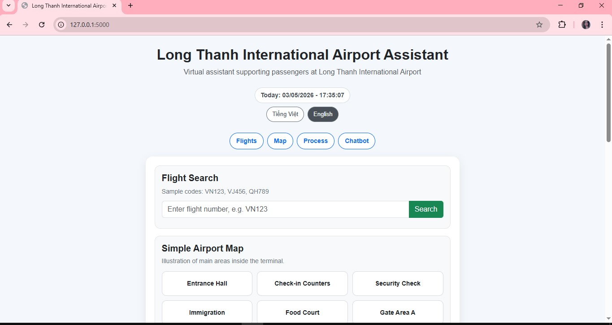
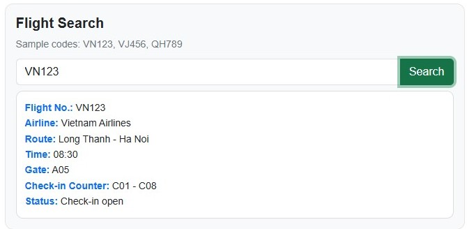
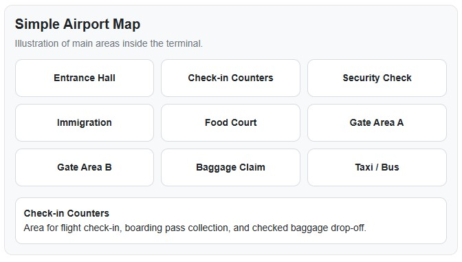
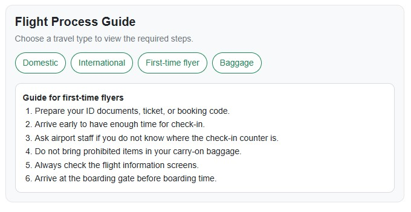
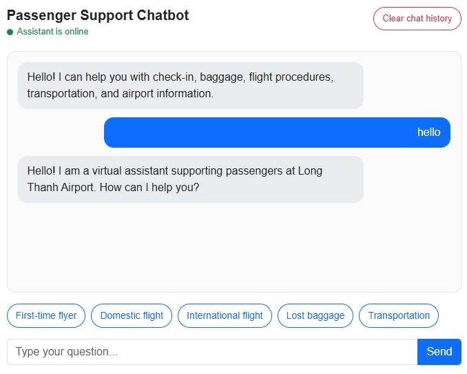

# LTIA Guide - Long Thanh International Airport Assistant

LTIA Guide là một ứng dụng web demo hỗ trợ hành khách tại **Sân bay Quốc tế Long Thành**.  
Ứng dụng được xây dựng bằng Flask, HTML, CSS, JavaScript và dữ liệu JSON.

Dự án mô phỏng một hệ thống hỗ trợ hành khách tại sân bay với các chức năng như chatbot hỏi đáp, tra cứu chuyến bay mẫu, bản đồ sân bay tương tác, hướng dẫn quy trình bay và giao diện song ngữ Việt / Anh.

---

## Giới thiệu

Trong môi trường sân bay quốc tế, hành khách thường cần tra cứu nhanh các thông tin như:

- Làm thủ tục check-in ở đâu
- Quy trình bay nội địa và quốc tế
- Hành lý ký gửi và hành lý xách tay
- Giấy tờ cần chuẩn bị
- Dịch vụ trong sân bay
- Phương tiện di chuyển
- Hỗ trợ khi gặp sự cố tại sân bay

LTIA Guide được xây dựng như một phiên bản MVP/demo nhằm hỗ trợ các nhu cầu cơ bản đó thông qua giao diện web đơn giản, dễ dùng và phù hợp để phát triển tiếp trong tương lai.

---

## Chức năng chính

- Chatbot hỏi đáp thông tin sân bay
- Chatbot hỗ trợ trả lời tiếng Việt và tiếng Anh
- Gợi ý câu hỏi nhanh
- Lưu lịch sử chat bằng LocalStorage
- Xóa lịch sử chat
- Hiệu ứng “Đang trả lời...”
- Tra cứu chuyến bay mẫu
- Hiển thị trạng thái chuyến bay song ngữ
- Bản đồ sân bay tương tác
- Hiển thị mô tả khi bấm vào từng khu vực bản đồ
- Hướng dẫn quy trình bay nội địa
- Hướng dẫn quy trình bay quốc tế
- Hướng dẫn người đi máy bay lần đầu
- Hướng dẫn thông tin hành lý
- Đồng hồ thời gian hiện tại
- Giao diện song ngữ Việt / Anh
- Menu điều hướng nhanh
- Trạng thái online của trợ lý
- Footer thông tin ứng dụng

---

## Công nghệ sử dụng

- Python 3.11
- Flask
- HTML
- CSS
- JavaScript
- JSON
- Bootstrap CDN
- LocalStorage

---

## Cấu trúc thư mục

```text
LTIA Guide/
├── app.py
├── requirements.txt
├── README.md
├── .gitignore
├── data/
│   ├── intents.json
│   └── flights.json
├── static/
│   ├── app.js
│   ├── style.css
│   └── images/
│       ├── home.png
│       ├── flight-search.png
│       ├── airport-map.png
│       ├── process-guide.png
│       └── chatbot.png
└── templates/
    └── index.html
```

---

## Hình ảnh giao diện

### Trang chính



### Tra cứu chuyến bay



### Bản đồ sân bay tương tác



### Hướng dẫn quy trình bay



### Chatbot hỗ trợ hành khách



---

## Cách chạy project

### Bước 1: Clone project từ GitHub

```bash
git clone <repository-url>
```

Sau khi tạo repository trên GitHub, thay `<repository-url>` bằng link GitHub thật của project.

Ví dụ:

```bash
git clone https://github.com/NguyenQuynhTrang4/ltia-guide.git
```

---

### Bước 2: Di chuyển vào thư mục project

Nếu thư mục project tên là `LTIA Guide`, chạy:

```bash
cd "LTIA Guide"
```

Nếu thư mục project tên là `ltia-guide`, chạy:

```bash
cd ltia-guide
```

---

### Bước 3: Tạo môi trường ảo Python

```bash
python -m venv venv
```

Lệnh này sẽ tạo thư mục `venv` để chứa môi trường Python riêng cho project.

---

### Bước 4: Kích hoạt môi trường ảo

Trên Windows PowerShell:

```powershell
.\venv\Scripts\Activate.ps1
```

Nếu PowerShell chặn chạy script, dùng lệnh sau:

```powershell
Set-ExecutionPolicy -Scope Process -ExecutionPolicy Bypass
.\venv\Scripts\Activate.ps1
```

Khi kích hoạt thành công, Terminal sẽ có dạng:

```text
(venv) PS C:\...\LTIA Guide>
```

---

### Bước 5: Cài đặt thư viện cần thiết

```bash
pip install -r requirements.txt
```

Project hiện sử dụng Flask, được khai báo trong file `requirements.txt`.

---

### Bước 6: Chạy ứng dụng

```bash
python app.py
```

Nếu chạy thành công, Terminal sẽ hiển thị gần giống:

```text
Running on http://127.0.0.1:5000
```

---

### Bước 7: Mở ứng dụng trên trình duyệt

Mở Chrome, Edge hoặc trình duyệt bất kỳ và truy cập:

```text
http://127.0.0.1:5000
```

---

### Bước 8: Dừng ứng dụng

Trong Terminal đang chạy Flask, nhấn:

```text
Ctrl + C
```

---

## Kiểm tra dữ liệu JSON

Trước khi chạy hoặc commit project, có thể kiểm tra file JSON bằng lệnh:

```bash
python -m json.tool data/intents.json
python -m json.tool data/flights.json
```

Nếu lệnh in ra nội dung JSON và không báo lỗi, nghĩa là dữ liệu hợp lệ.

---

## Dữ liệu mẫu

### Mã chuyến bay mẫu

Bạn có thể nhập các mã chuyến bay sau để test chức năng tra cứu:

- VN123
- VJ456
- QH789

### Ví dụ dữ liệu chuyến bay

```json
{
  "flight_no": "VN123",
  "airline": "Vietnam Airlines",
  "route": "Long Thanh - Ha Noi",
  "time": "08:30",
  "gate": "A05",
  "checkin_counter": "C01 - C08",
  "status": "Đang làm thủ tục"
}
```

---

## Nhóm dữ liệu chatbot

Chatbot hiện hỗ trợ các nhóm câu hỏi như:

- Chào hỏi
- Check-in
- Quy trình bay nội địa
- Quy trình bay quốc tế
- Hành lý
- Thất lạc hành lý
- Phương tiện di chuyển
- Người đi máy bay lần đầu
- Giấy tờ tùy thân
- Thời gian nên đến sân bay
- Vật phẩm bị cấm
- Dịch vụ sân bay
- Hỗ trợ hành khách đặc biệt
- Sự cố sân bay

Dữ liệu chatbot được lưu trong file:

```text
data/intents.json
```

Mỗi nhóm intent có dạng:

```json
{
  "tag": "greeting",
  "patterns": [
    "xin chào",
    "hello",
    "hi"
  ],
  "response": "Xin chào! Tôi là trợ lý ảo hỗ trợ hành khách tại Sân bay Quốc tế Long Thành. Bạn cần tôi giúp gì?",
  "response_en": "Hello! I am a virtual assistant supporting passengers at Long Thanh International Airport. How can I help you?"
}
```

Trong đó:

- `tag`: tên nhóm câu hỏi
- `patterns`: các câu người dùng có thể hỏi
- `response`: câu trả lời tiếng Việt
- `response_en`: câu trả lời tiếng Anh

---

## Một số câu hỏi có thể thử với chatbot

### Tiếng Việt

```text
xin chào
```

```text
tôi đi máy bay lần đầu
```

```text
quy trình bay quốc tế
```

```text
đi máy bay cần giấy tờ gì
```

```text
nên đến sân bay trước bao lâu
```

```text
không được mang gì lên máy bay
```

```text
sân bay có wifi không
```

```text
có xe lăn trong sân bay không
```

```text
tôi bị trễ chuyến bay
```

### English

```text
hello
```

```text
where is check in
```

```text
domestic flight process
```

```text
international flight process
```

```text
what documents do i need to fly
```

```text
how early should i arrive at the airport
```

```text
what can i not bring on the plane
```

```text
is there wifi at the airport
```

```text
i need a wheelchair
```

```text
i missed my flight
```

---

## Giao diện song ngữ

Ứng dụng hỗ trợ chuyển đổi giao diện giữa:

- Tiếng Việt
- English

Các phần đã hỗ trợ song ngữ:

- Tiêu đề ứng dụng
- Mô tả ứng dụng
- Menu điều hướng
- Tra cứu chuyến bay
- Kết quả tra cứu chuyến bay
- Bản đồ sân bay
- Mô tả khu vực trên bản đồ
- Quy trình bay
- Nút chức năng
- Placeholder ô nhập
- Chatbot trả lời tiếng Việt và tiếng Anh

---

## Cách thêm ảnh vào README

### Bước 1: Tạo thư mục ảnh

Trong project, tạo thư mục:

```text
static/images/
```

### Bước 2: Thêm ảnh vào thư mục

Ví dụ thêm các ảnh:

```text
main.jpg
flight-search.jpg
airport-map.jpg
process-guide.jpg
chatbot.jpg
```

### Bước 3: Gọi ảnh trong README

Cú pháp Markdown:

```markdown

```

Ví dụ:

```markdown

```

Nếu ảnh không hiện trên GitHub, kiểm tra lại:

- Tên file ảnh có đúng không
- Đường dẫn có đúng không
- File ảnh đã được commit lên Git chưa
- Tên file không nên có dấu tiếng Việt hoặc khoảng trắng

---

## Ghi chú về `.gitignore`

Project có file `.gitignore` để tránh upload các file không cần thiết lên GitHub, ví dụ:

```text
venv/
__pycache__/
.env
.vscode/
*.log
```

Không nên đưa thư mục `venv` lên GitHub vì thư mục này rất nặng và có thể tạo lại bằng lệnh:

```bash
python -m venv venv
```

---

## Trạng thái hiện tại

Đây là phiên bản MVP/demo phục vụ học tập và trình bày ý tưởng.

Dữ liệu chuyến bay và bản đồ hiện là dữ liệu mẫu, chưa kết nối với hệ thống thời gian thực.

---

## Hướng phát triển trong tương lai

Trong các phiên bản tiếp theo, LTIA Guide có thể được phát triển theo các hướng sau:

### 1. Kết nối dữ liệu chuyến bay thời gian thực

Hiện tại dữ liệu chuyến bay đang được lưu trong file JSON mẫu.  
Trong tương lai, hệ thống có thể tích hợp API chuyến bay thật để cập nhật:

- Giờ bay
- Cổng ra máy bay
- Quầy check-in
- Trạng thái chuyến bay
- Thông tin trễ chuyến hoặc hủy chuyến

Điều này giúp ứng dụng hoạt động gần hơn với hệ thống hỗ trợ hành khách thực tế tại sân bay.

### 2. Thêm cơ sở dữ liệu

Dữ liệu hiện tại đang được lưu bằng file JSON.  
Có thể nâng cấp sang cơ sở dữ liệu như SQLite, MySQL hoặc PostgreSQL để quản lý dữ liệu tốt hơn.

Các dữ liệu có thể lưu trong database gồm:

- Danh sách chuyến bay
- Nội dung chatbot
- Lịch sử câu hỏi
- Thông tin khu vực trong sân bay
- Dịch vụ hỗ trợ hành khách

### 3. Xây dựng trang quản trị

Có thể phát triển thêm trang quản trị để nhân viên dễ dàng cập nhật dữ liệu mà không cần sửa trực tiếp file JSON.

Trang quản trị có thể hỗ trợ:

- Thêm, sửa, xóa chuyến bay
- Cập nhật trạng thái chuyến bay
- Quản lý câu hỏi và câu trả lời chatbot
- Quản lý dữ liệu bản đồ sân bay
- Quản lý nội dung song ngữ Việt / Anh

### 4. Nâng cấp chatbot thông minh hơn

Chatbot hiện tại hoạt động theo hướng intent-based, dựa trên các mẫu câu có sẵn trong file JSON.  
Trong tương lai có thể nâng cấp bằng các kỹ thuật AI như:

- Tìm kiếm ngữ nghĩa bằng embeddings
- RAG từ tài liệu PDF
- Tích hợp mô hình ngôn ngữ lớn
- Gợi ý câu trả lời theo ngữ cảnh
- Hỗ trợ nhiều ngôn ngữ hơn

Điều này giúp chatbot trả lời linh hoạt hơn, kể cả khi người dùng hỏi bằng câu không giống hoàn toàn dữ liệu mẫu.

### 5. Tích hợp tài liệu hướng dẫn sân bay

Có thể bổ sung chức năng đọc và tra cứu thông tin từ các tài liệu như:

- Quy định hành lý
- Quy trình check-in
- Quy định xuất nhập cảnh
- Hướng dẫn an ninh hàng không
- Dịch vụ hỗ trợ hành khách đặc biệt

Khi đó chatbot có thể trả lời dựa trên tài liệu chính thức thay vì chỉ dựa trên dữ liệu mẫu.

### 6. Cải thiện bản đồ sân bay

Bản đồ hiện tại là bản đồ minh họa đơn giản.  
Có thể nâng cấp thành bản đồ trực quan hơn với:

- Sơ đồ tầng
- Vị trí các cổng ra máy bay
- Vị trí quầy check-in
- Khu vực nhà hàng, ATM, nhà vệ sinh
- Chỉ đường từ vị trí hiện tại đến khu vực cần tìm

### 7. Cải thiện giao diện người dùng

Có thể nâng cấp UI/UX để ứng dụng thân thiện hơn với hành khách:

- Thiết kế responsive tốt hơn cho điện thoại
- Thêm biểu tượng trực quan
- Thêm chế độ sáng/tối
- Thêm animation nhẹ
- Tối ưu giao diện cho kiosk hoặc màn hình thông tin sân bay

### 8. Triển khai online

Ứng dụng có thể được triển khai lên các nền tảng cloud như Render, Railway hoặc PythonAnywhere để người dùng có thể truy cập qua Internet.

Sau khi deploy, project có thể có:

- Link demo online
- Tự động cập nhật khi push code lên GitHub
- Môi trường chạy ổn định hơn so với localhost

### 9. Đóng gói thành PWA

Trong tương lai có thể phát triển ứng dụng thành Progressive Web App, giúp người dùng có trải nghiệm gần giống ứng dụng cài đặt trên điện thoại.

PWA có thể hỗ trợ:

- Thêm biểu tượng ra màn hình chính
- Tải nhanh hơn
- Giao diện giống mobile app
- Một số chức năng hoạt động offline

### 10. Mục tiêu dài hạn

Mục tiêu dài hạn của LTIA Guide là trở thành một hệ thống hỗ trợ hành khách thông minh cho sân bay, có thể cung cấp thông tin nhanh, chính xác và dễ hiểu cho cả hành khách Việt Nam và hành khách quốc tế.

---

## Tác giả

Nguyễn Quỳnh Trang

Dự án được phát triển nhằm mục đích xây dựng demo ứng dụng hỗ trợ hành khách tại Sân bay Quốc tế Long Thành.

```text
LTIA Guide - Long Thanh International Airport Assistant
```